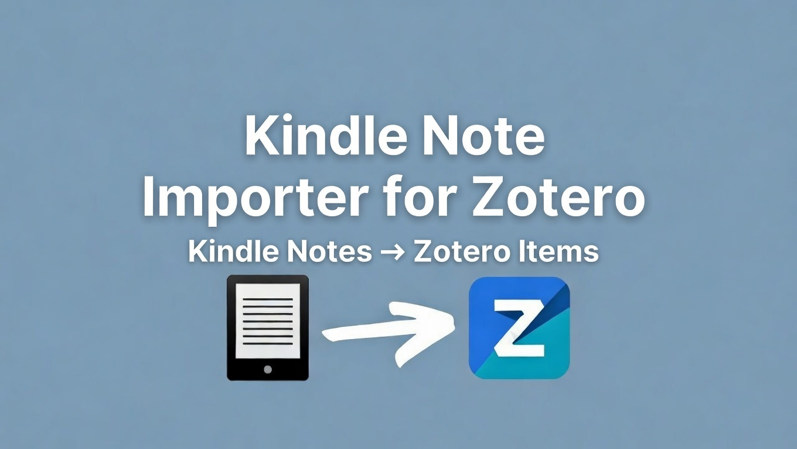

# Kindle Highlights → Zotero Importer

A Zotero 7 plugin that imports your Kindle highlights and notes from `My Clippings.txt` directly into your Zotero library — matching them to existing items and creating new ones as needed.

 



---

## Features

- Parses `My Clippings.txt` from any Kindle device
- Fuzzy-matches Kindle books against your existing Zotero library by title and author
- Wizard UI with 5 steps: Load → Preview → Review → Import → Done
- Handles subtitle variations (e.g. "Four Thousand Weeks" matches "Four thousand weeks: Time Management for Mortals")
- Lets you manually resolve uncertain matches or mark books as new
- "Mark all as new books" bulk action for quick processing
- Adds highlights and notes as child note items in Zotero
- Detects previously imported highlights to avoid duplicates on re-import
- Looks up new books via Google Books and Open Library APIs to create proper Zotero entries with ISBN, publisher, etc.
- Organizes imported books into a "Kindle Imports" collection

---

## Requirements

- **Zotero 7.0+** (not compatible with Zotero 6)
- macOS, Windows, or Linux

---

## Installation

1. Download the latest `kindle-importer.xpi` from the [Releases](../../releases) page
2. In Zotero, go to **Tools → Add-ons**
3. Click the gear icon → **Install Add-on From File...**
4. Select the downloaded `.xpi` file
5. Restart Zotero when prompted

---

## Usage

1. Connect your Kindle via USB and locate `My Clippings.txt` (usually in the `documents/` folder on the Kindle drive)
2. In Zotero, go to **Tools → Import Kindle Highlights**
3. Follow the 5-step wizard:
   - **Load File** — select your `My Clippings.txt`
   - **Preview** — review how your books matched against your Zotero library
   - **Review** — resolve uncertain matches, or mark books as new
   - **Import** — highlights are added as notes to each book
   - **Done** — summary of what was imported

You can safely re-run the import at any time — previously imported highlights are detected and skipped.

---

## How It Works

### Parsing
`src/parser.js` reads `My Clippings.txt` and groups highlights and notes by book. It handles the Kindle clippings format — entries separated by `==========`, with metadata lines like `- Your Highlight on page 12 | location 150-155 | Added on Monday, January 1, 2024`.

### Matching
`src/matcher.js` compares each Kindle book title and author against every item in your Zotero library using a combination of:
- **Dice coefficient** on word tokens (case-insensitive, stop words removed)
- **Containment score** to handle subtitle mismatches
- **Author verification** — when both sides have author data, it must agree

Short titles (3 words or fewer) require a stricter threshold since they're more likely to false-match.

### Book Lookup
`src/bookLookup.js` fetches metadata for books not in your Zotero library so they can be created as proper Zotero items. It tries three sources in order: [Google Books API](https://developers.google.com/books) (title + author), Google Books (title only), then [Open Library API](https://openlibrary.org/developers/api) as a fallback. No API keys are required. If all three fail, it creates a minimal record from whatever Kindle data is available.

### Importing
`src/importer.js` creates Zotero note items as children of each matched book, formatted with highlight text, location, and date. It uses fingerprinting to detect previously imported notes, so re-running the import won't create duplicates.

---

## Development

No build step or external dependencies required. The plugin is plain JavaScript packaged as an XPI (zip) file.

### Project Structure

```
ZoteroKindleNotes/
├── manifest.json          # Zotero 7 plugin metadata
├── bootstrap.js           # Plugin lifecycle hooks (startup/shutdown)
├── chrome/
│   └── content/
│       ├── dialog.xhtml   # 5-screen wizard UI
│       └── dialog.js      # UI logic and state management
├── src/
│   ├── parser.js          # My Clippings.txt parser
│   ├── matcher.js         # Fuzzy book matching against Zotero library
│   ├── bookLookup.js      # Google Books + Open Library API lookups
│   └── importer.js        # Zotero item and note creation
└── kindle-importer.xpi    # Built plugin
```

### Building the XPI

```bash
zip -r kindle-importer.xpi manifest.json bootstrap.js src/ chrome/
```

---

## Known Limitations

- Very short book titles (1-2 words) may occasionally false-match — use the Review screen to correct these
- Book metadata from external APIs may sometimes be incomplete (missing ISBN, publisher, etc.) — the import will still succeed with whatever fields are available
- Only reads Kindle's `My Clippings.txt` format; other highlight export formats are not yet supported

---

## License

[MIT](LICENSE)

---

## Contributing

Issues and PRs welcome. There's room to improve the matching logic, add support for other highlight export formats, and more.
